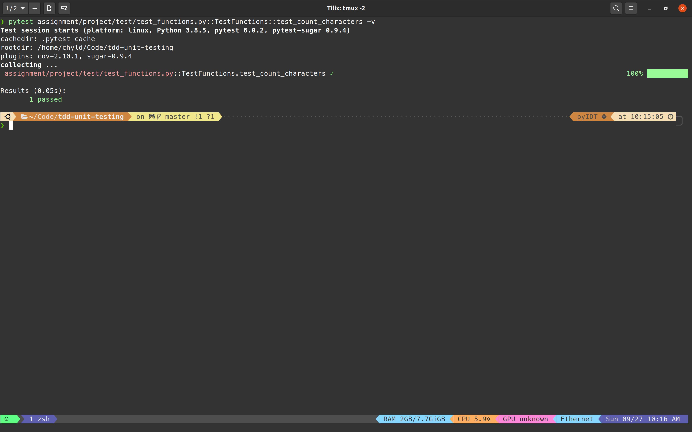
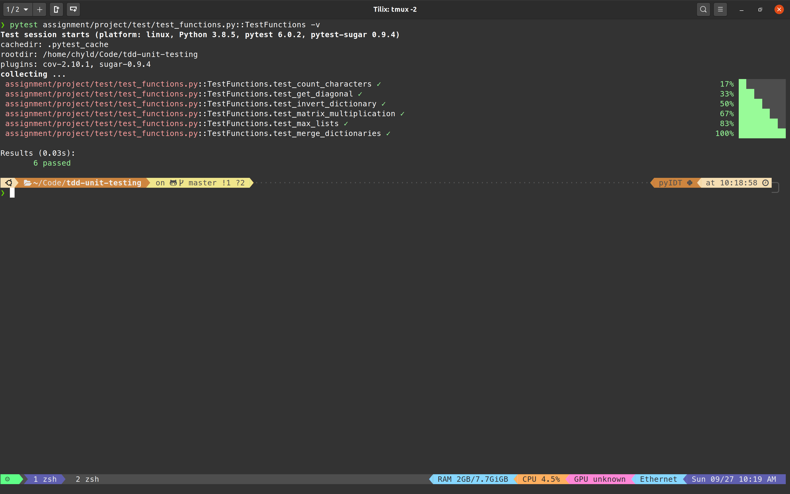
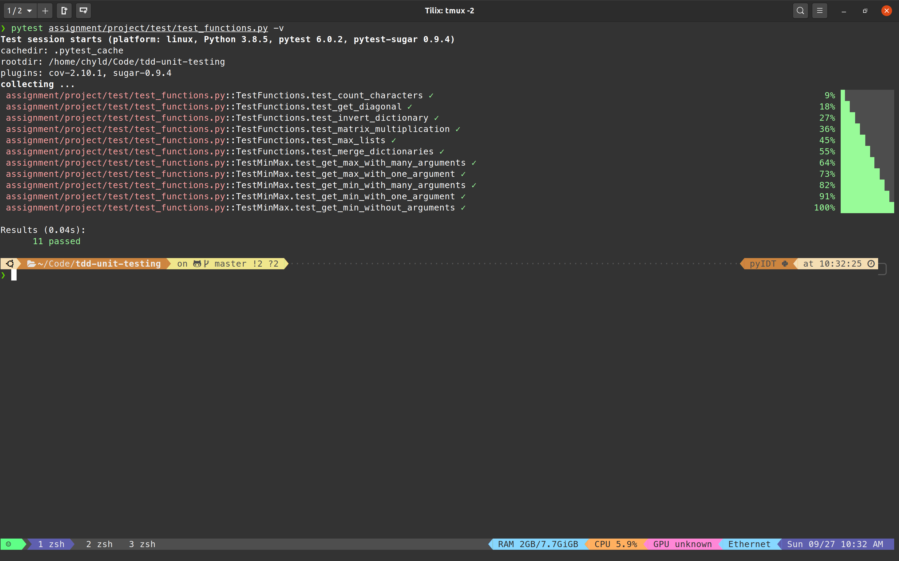
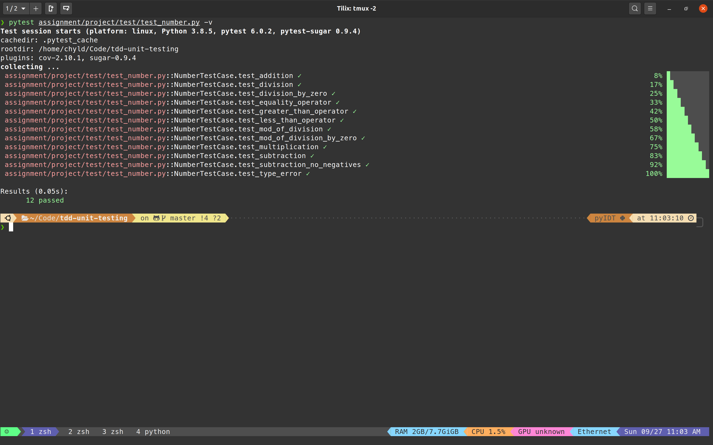
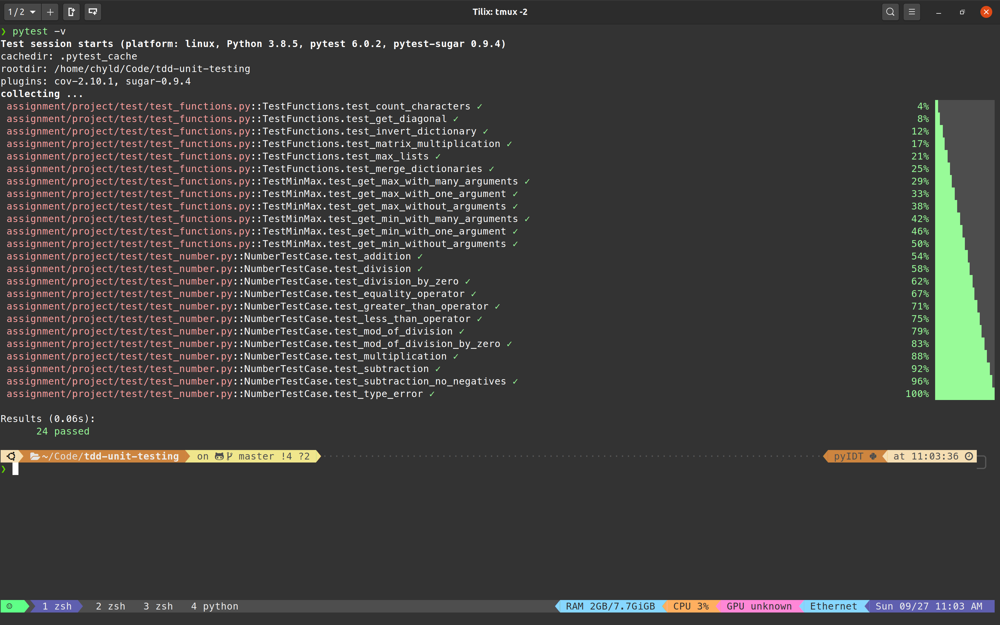

# tdd-unit-testing

### Overview

The purpose of this assignment is to familarize yourself with testing in python.

In the world of software engineering, there is an emphasis on testing first and then write the actual implementation. In data science, we do not have to strictly conform to these guidelines. We can write our tests before or after. The main point is that we have some type of testing to help us guarantee that our code is working properly.

### Setup

These tests have been written in `unittest`, which is a built-in module that comes with python. However, we are going to `exectute` these tests using `pytest`. `pytest` provides a much nicer output and is more user friendly. It also happens to be the most used testing framework for the python language.

Let's make sure we have `pytest` installed.

```
$ pip install pytest
```

### Assignment

There are 2 main assignments that involve either writing tests or making tests pass or a combination. We will walk through them now.

- Open up your code editor inside this repository.
- Make sure your terminal is also open to this repository.
- Open `test_functions.py` and `functions.py`.
    - There are 2 classes in this file.
    - The `TestFunctions` class has all the tests already written. You need to make the tests pass by implementing the code in `functions.py`.
    - In the `TestMinMax` class, you have to implement the test functions based on the docstring of the functions in the `functions.py` file.
- Open `test_number.py` and `number.py`.
    - The tests have already been written.
    - You need to implement the code inside the `Number` class.
- Below are some examples on how to run:
    - Single tests
    - All tests within a class
    - All tests within a file
    - All tests in a project

### Single Test

If you would like to just run a single test, use the following code as a template. It goest `pytest` followed by the filenaeme, two colons, the name of the class, two colons, and then the name of the method inside the class. The following runs the `test_count_characters` test inside the `TestFunctions` class in the `test_functions.py` file.

`pytest assignment/project/test/test_functions.py::TestFunctions::test_count_characters -v`



### All the tests in the `TestFunctions` class

`pytest assignment/project/test/test_functions.py::TestFunctions -v`




### All the tests in the `test_functions.py` file

`pytest assignment/project/test/test_functions.py -v`



### All the tests in the `test_number.py` file

`pytest assignment/project/test/test_number.py -v`



### Run all the tests in the project

`pytest -v`


